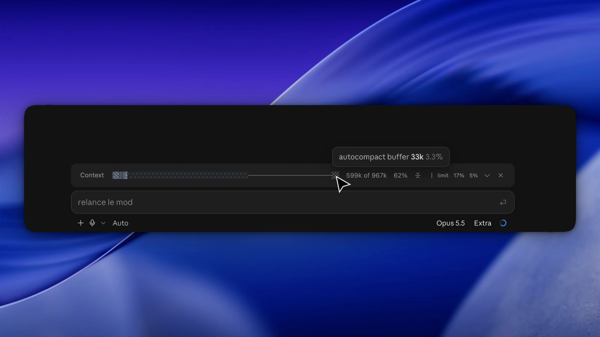

<!-- Demo image: add public/compact-token-bar.png (or .gif) and uncomment.
<p align="center">
  
</p>
-->

# Compact Token Bar

> **Your context window in one quiet line, grey until it matters.**

A Claude Code mod that sits above the prompt and shows how full your context is, your session and weekly limits, and a one-click compact button.

It stays neutral by default. A figure only turns orange, then red, when it gets close to its limit.

## What it shows

```txt
Context  ▆▆⠿⠿⠿⠿────────────▃   491k of 967k  51%  ≍  │ limit  9%  4%  ∨  ×
```

- **The bar**: what fills the window (system prompt, tools, MCP tools, memory files, skills, messages), then free space and the compaction buffer. Each category has its own pattern, so it reads without color.
- **The fill**: tokens used against the real limit, the point where auto-compaction runs, and the matching percentage.
- **Compact**: compacts the conversation now, like `/compact`.
- **Limits**: your 5-hour session and weekly usage, in that order. Hover for the full label and the reset time. A plan without a session window shows the weekly one alone.
- **Details**: the chevron unfolds a legend with each category's tokens and share.
- **Close**: hides the bar. Your choice is kept across sessions.

Everything is grey until a figure reaches 70% (orange), then 90% (red).

## How to use

Once installed, the bar appears above the prompt in every new session. It refreshes after each turn and after a compaction, from the same breakdown `/context` draws, estimated locally (no extra API calls).

| Action | How |
| --- | --- |
| Show or hide the bar | `/compact-token-bar` |
| Compact now | the compact button after the percentage |
| See the details | the chevron |
| See what a segment or a limit is | hover it |

## Desktop and terminal

The desktop app is the reference design: small text, real stripes and dots drawn as SVG, tooltips on hover.

The terminal shows the same single line with characters (`▆`, `⠿`, `▃`, `─`) at the terminal's own text size. Tooltips are less reliable there, so nothing essential depends on them.

## Limitations

- Mods are a recent Claude Code feature: you need **Claude Code 2.1.287 or later**, and an update can change the mod API.
- Session and weekly limits appear only when you are signed in with a Claude subscription. They are known after the first response; until then the bar shows the last values seen, if they have not reset.
- Compacting runs between turns only. While Claude is answering, the button asks you to try again.
- On desktop, widths are estimated from terminal columns, so spacing can shift slightly with the window size.

## Install in Claude Code

This repository is its own plugin marketplace.

```sh
claude plugin marketplace add arthurglaizal/compact-token-bar
claude plugin install compact-token-bar@arthur-mods
```

Or, in a Claude Code session:

```txt
/plugin marketplace add arthurglaizal/compact-token-bar
/plugin install compact-token-bar@arthur-mods
```

Start a new session and the bar appears above the prompt.

To try it without installing, clone the repository and run:

```sh
claude --plugin-dir ./compact-token-bar
```

## Repository structure

```txt
compact-token-bar/
├── README.md
├── LICENSE
├── .claude-plugin/
│   ├── plugin.json
│   └── marketplace.json
├── hooks/
│   ├── hooks.json
│   └── register.tsx
├── types/index.d.ts
└── tests/compact-token-bar.test.tsx
```

Run the checks with `claude plugin validate .` and `claude plugin test .`.

## Credits

Built on [context-bar](https://github.com/hamzafer/claude-code-mods) by Hamza Zafar (MIT), redesigned around a quieter, single-line layout.

## More AI workflow commands

Small, portable commands for Claude Code, Codex, and any AI assistant.

| Command | What it does |
| --- | --- |
| [Noob Command](https://github.com/arthurglaizal/noob-command) | Turns the last AI answer into something immediately understandable. |
| [WaitGo](https://github.com/arthurglaizal/wait-go) | Batches your instructions, then executes only when you say go. |
| [Session Recap](https://github.com/arthurglaizal/session-recap) | Recaps what you did in the current session and what to pick up next. |
| [Ask Mode](https://github.com/arthurglaizal/ask-mode) | Lets you question your codebase without the assistant changing anything. |
| [AI Handoff](https://github.com/arthurglaizal/ai-handoff) | Packages the current context so another AI can continue the work. |
| [FYI](https://github.com/arthurglaizal/fyi-command) | Gives your assistant context without giving it a task. |

## Support

If you find my work useful, you can [buy me a coffee](https://ko-fi.com/arturo_ux) ☕️

## License

MIT — see [LICENSE](LICENSE).
